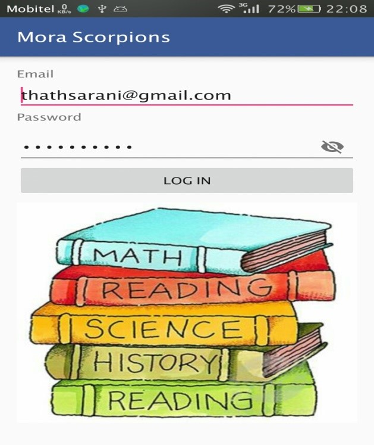

# Collaborative portal for a school - Level 02 industry based software project

Mentored by Virtusa(pvt) ltd. A web and android based system to facilitate
the collaborativeness of different roles in a school. Attendance, Syllabus,
Notes, Notices, Homework and Complain handling, realtime chat etc were 
implemented. Developed the android application of the system.

This is the code base for android application. 

**Screenshots**

- Login

- Navigation Panel

- profile view

- Marking attendance

- View attendance percentage

- View Homeworks and Notes

- Commenting on notes

- Realtime chat (parents and teachers)

Final Report https://github.com/LahiruJayasekara/MoraScorpions-School/blob/master/final-Report.pdf
